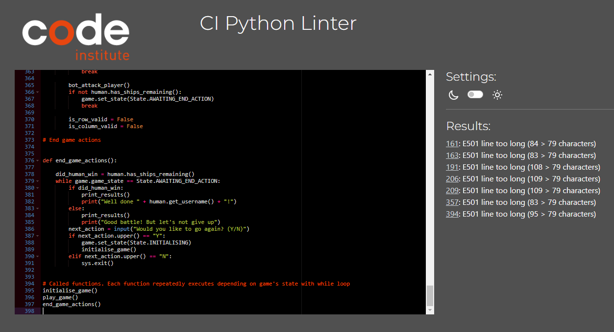
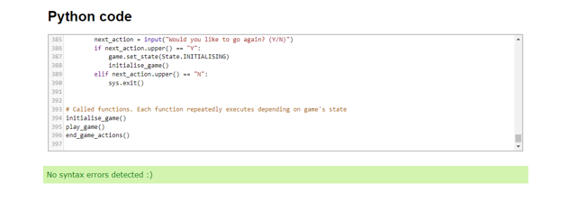
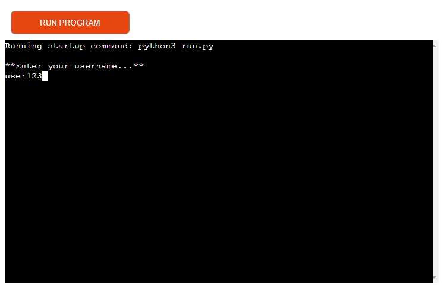
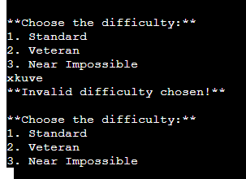
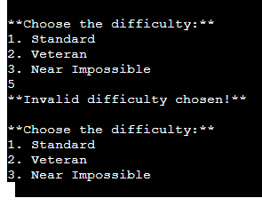
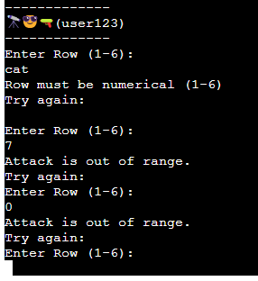
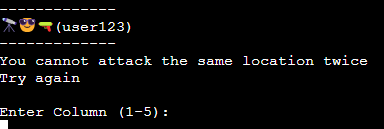
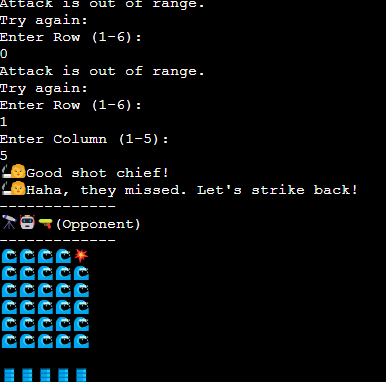

## Battleship
This battleship game is a Python terminal game that is delpoyed on Heroku which runs on a Code Institute mock terminal.

Here is the [LINK](https://ui.dev/amiresponsive?url=https://battle-ship-374754bb61b4.herokuapp.com/)

This game can be played by users gussing the location of the computers battleship in a 6 row by 5 colums.

There are 3 difficulties ;

-Standard

-Veteran

-Near Impossible

## How to play

First the user has to enter Username and then 2 boards are generated.

The water is resembled with a 🌊 emoji and the ship is resembled with a 🚢.

Once the ship is attacked it will show a 💥 emoji and if missed, it will show a 🔥 emoji.

Whoever takes out the opponents Ships first wins ther game.

## Data Model

I have chosen Board as a model as it is a great example that has the features insides aligned and intact such as water and ships. It even appears visibly appealing and with the Emojis it increases the looks instead of a dot and cross method.

I can add and remove the size of the board and it will stay perfectly in position. 

## Errors

There were a few issues such as both of the boards have the ships visible which is wrong as the user should only see their own ships on board and not the Bots.

## Testing and Validation

I have tested this Terminal through multiple ways

- Tested through PEP8 linter with only issue being line too long which i cannot resolve

- Tested through Python Code Checker which showed no issues 

- Tested to show reponse such as adding incoorect numbers, writing same points and it worked perfeclty fine.

## Deployment

- Clone this repository

- Create new Heroku account

- set buildpacks in the order of first Python and then NodeJS

- linked the Heroku account to this repository

- Clicked on Deploy

## Credits

- Code Institute for the deployment terminal

- Heroku for deplayed project

